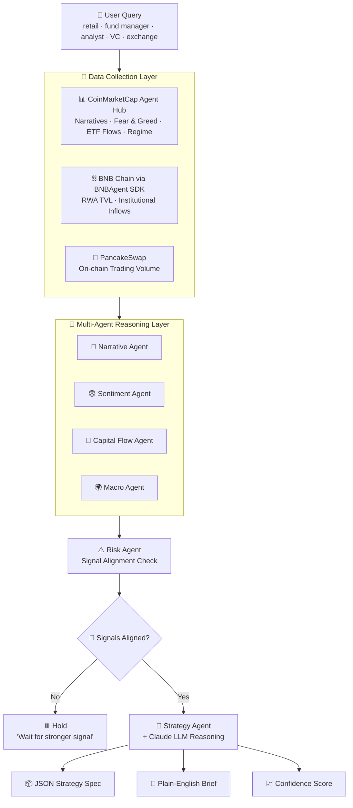

<div align="center">

# 🌌 AURA AI
### *Autonomous Understanding of Rotation & Allocation*

**The multi-agent capital-rotation brain for BNB Chain — powered by CoinMarketCap's Agent Hub**

[](https://dorahacks.io)
[](#)
[](#)
[](#)
[](#)
[](#)

> *"Every morning, fund managers spend 3 hours across 6 browser tabs trying to figure out where capital is rotating. AURA collapses that into a single 30-second AI call."*

</div>

---

## 📑 Table of Contents

1. [The Problem](#-the-problem)
2. [The Solution — What is AURA](#-the-solution--what-is-aura)
3. [Why AURA Wins](#-why-aura-wins)
4. [System Architecture](#-system-architecture)
5. [The Six Agents](#-the-six-agents)
6. [Tech Stack](#-tech-stack)
7. [Data Sources](#-data-sources)
8. [Sample Output](#-sample-output)
9. [Project Structure](#-project-structure)
10. [Getting Started](#-getting-started)
11. [API Usage](#-api-usage)
12. [CMC Skill Registration](#-cmc-skill-registration)
13. [One Engine, Five Audiences](#-one-engine-five-audiences)
14. [Roadmap](#-roadmap)
15. [Hackathon Submission Details](#-hackathon-submission-details)
16. [License](#-license)

---

## 🧩 The Problem

Crypto capital never sits still — it rotates between narratives (RWA → AI tokens → Perp DEXs) faster than most people can track. Right now, a trader trying to answer *"where should my money be this week?"* has to manually:

- 🔎 Check CoinMarketCap for trending sectors
- 😨 Check the Fear & Greed Index
- 🏦 Track institutional flows (BlackRock, Franklin Templeton) into BNB Chain's RWA ecosystem
- 📊 Open Nansen/DefiLlama for on-chain confirmation
- 🐦 Scroll Twitter for sentiment
- 🤔 Sit and synthesize all of it — and often still get it wrong

**AURA replaces that entire ritual with one structured AI call.**

---

## 💡 The Solution — What is AURA

**AURA is a CMC Skill** — a multi-agent AI system wired into the **CoinMarketCap AI Agent Hub** — that reads live market intelligence, detects when capital is rotating between narratives on **BNB Chain**, and outputs a clean, backtestable **strategy specification**.

The core, hard-to-copy insight:

> 🏦 **Institutional RWA inflows are a leading indicator.** When BlackRock's BUIDL or Franklin Templeton's iBENJI add fresh capital to BNB Chain, retail and broader ecosystem tokens tend to follow days later. Most strategy tools ignore this entirely — AURA watches it as a first-class signal.

AURA doesn't just hand you another number to interpret. It hands you a **decision**:

```
📍 Active Narrative   : RWA → AI Infrastructure rotation
🌡️  Market Regime      : Risk-On
🎯 Recommendation     : Rotate 20% into RWA-aligned BNB Chain assets
📈 Confidence Score   : 78%
```

---

## 🏆 Why AURA Wins

| Judging Criterion | How AURA Delivers |
|---|---|
| ⚙️ **Technical Execution** | A real, running multi-agent pipeline pulling **live** CMC + BNB Chain data — not a mockup |
| 🌟 **Originality** | First skill to treat institutional RWA flow on BNB Chain as a *leading indicator*, not just another data point |
| 🌍 **Real-World Relevance** | Solves a daily, concrete workflow problem for fund managers, analysts, and retail traders alike |
| 🎬 **Demo & Presentation** | One call → plain-English brief + JSON spec + confidence score. Instantly legible to a judge |

### 🥇 Special Prize Alignment

| Special Prize | AURA's Angle |
|---|---|
| 🔵 **Best Use of Agent Hub** | Narratives, Fear & Greed, ETF flow, and market-regime signals are the core reasoning inputs — not a footnote |
| 🟡 **Best Use of BNB AI Agent SDK** | Used to pull live RWA TVL and PancakeSwap volume directly from BNB Chain as a leading-indicator data source |

---

## 🏗️ System Architecture



**Flow in plain words:** data is pulled simultaneously from CMC and BNB Chain → four specialist agents score the market independently → a risk agent checks if the signals genuinely agree → if they do, an LLM-powered strategy agent writes a structured, backtestable rotation plan. If they don't agree, AURA explicitly tells you to wait — knowing when **not** to trade is part of the product.

---

## 🤖 The Six Agents

| # | Agent | Emoji | Role |
|---|---|---|---|
| 1 | **Narrative Agent** | 📰 | Scores which sector (RWA / AI / Perp DEX) is gaining the most momentum right now |
| 2 | **Sentiment Agent** | 😨 | Reads the Fear & Greed Index + social sentiment to gauge market mood |
| 3 | **Capital Flow Agent** | 🏦 | *The moat.* Tracks institutional RWA inflows (BlackRock BUIDL, Franklin Templeton iBENJI) on BNB Chain |
| 4 | **Macro Agent** | 🌍 | Reads ETF demand + cross-asset pressure to classify risk-on vs. risk-off regime |
| 5 | **Risk Agent** | ⚠️ | Checks signal alignment across all agents and gates whether a strategy should even be generated |
| 6 | **Strategy Agent** | 🎯 | Combines every signal + an LLM reasoning pass into the final rotation brief and JSON spec |

---

## 🛠️ Tech Stack

| Layer | Technology |
|---|---|
| 🐍 Backend | Python + **FastAPI** |
| 🧠 LLM Reasoning | **Anthropic Claude API** |
| 📊 Market Intelligence | CoinMarketCap **AI Agent Hub** (MCP) |
| ⛓️ On-chain Data | **BNB Chain** via **BNBAgent SDK** |
| 🥞 DEX Data | PancakeSwap public endpoints |
| 📦 Output Format | Structured JSON (backtester-compatible) |

---

## 📡 Data Sources

| Source | What AURA Pulls |
|---|---|
| **CoinMarketCap Agent Hub** | Trending narratives, Fear & Greed Index, ETF flow data, pre-computed market regime signals |
| **BNB Chain (BNBAgent SDK)** | RWA TVL movement, BlackRock BUIDL / Franklin Templeton iBENJI balance changes |
| **PancakeSwap** | Live on-chain trading volume for relevant BNB Chain tokens |

---

## 📦 Sample Output

```json
{
  "active_narrative": "RWA",
  "regime": "risk-on",
  "recommendation": "Rotate 20% of portfolio into RWA-aligned BNB Chain assets (e.g. ONDO)",
  "entry_condition": "RWA TVL rising AND Fear & Greed Index > 35",
  "exit_condition": "RWA TVL drops 10% OR Fear & Greed Index < 25",
  "position_size": "20% of portfolio",
  "confidence_score": 78,
  "reasoning": "Institutional RWA inflows (BlackRock BUIDL, Franklin Templeton iBENJI) into BNB Chain rose this week — historically a leading indicator for broader ecosystem rotation."
}
```

**Plain-English Brief (auto-generated alongside the spec):**

> *"Institutions have been quietly adding capital to BNB Chain's RWA ecosystem this week. Historically, that's been a signal retail follows 5–10 days later. AURA is flagging a moderate-to-strong rotation opportunity into RWA-aligned tokens — confidence: 78%."*

---

## 📂 Project Structure

```
aura-ai/
├── main.py                      # FastAPI entry point
├── agents/
│   ├── narrative_agent.py
│   ├── sentiment_agent.py
│   ├── capital_flow_agent.py
│   ├── macro_agent.py
│   ├── risk_agent.py
│   └── strategy_agent.py
├── core/
│   ├── decision_engine.py       # Signal alignment + confidence scoring
│   └── strategy_generator.py    # Claude-powered spec + brief generation
├── data/
│   ├── cmc_fetcher.py           # CoinMarketCap Agent Hub connector
│   └── bnb_fetcher.py           # BNBAgent SDK connector
├── skill.json                   # CMC Agent Hub skill definition
├── requirements.txt
├── .env.example
└── README.md
```

---

## 🚀 Getting Started

### Prerequisites
- Python 3.10+
- A [CoinMarketCap API key](https://coinmarketcap.com/api/)
- An [Anthropic API key](https://console.anthropic.com/)
- BNB Smart Chain RPC access

### Installation

```bash
# 1. Clone the repo
git clone https://github.com/<your-username>/aura-ai.git
cd aura-ai

# 2. Create and activate a virtual environment
python -m venv venv
source venv/bin/activate        # Windows: venv\Scripts\activate

# 3. Install dependencies
pip install -r requirements.txt

# 4. Configure environment variables
cp .env.example .env
# then add:
# CMC_API_KEY=your_coinmarketcap_key
# ANTHROPIC_API_KEY=your_claude_key
# BSC_RPC_URL=your_bnb_chain_rpc

# 5. Run the server
uvicorn main:app --reload --port 8000
```

---

## 🔌 API Usage

```bash
curl -X POST http://localhost:8000/api/rotate \
  -H "Content-Type: application/json" \
  -d '{"user_type": "fund_manager"}'
```

**Response:** the JSON strategy spec shown in [Sample Output](#-sample-output) above, plus the plain-English brief and confidence score.

---

## 🪪 CMC Skill Registration

AURA is registered as a formal **CMC Skill** on the [Agent Hub](https://coinmarketcap.com/api/agent), described via `skill.json`:

```json
{
  "name": "aura-ai",
  "description": "Multi-agent capital rotation intelligence for BNB Chain, combining narrative momentum, institutional RWA flows, and macro regime into a backtestable strategy spec.",
  "inputs": {
    "user_type": "retail | fund_manager | analyst | vc | exchange"
  },
  "outputs": [
    "json_strategy_spec",
    "plain_english_brief",
    "confidence_score"
  ]
}
```

---

## 🎭 One Engine, Five Audiences

The six-agent core never changes — only the requester and the output framing do:

| User Type | What They Ask | What They Get |
|---|---|---|
| 🧍 **Retail Trader** | "Where should I put $500 this week?" | Plain-English advice, simplified risk framing |
| 💼 **Fund Manager** | "Where's capital rotating on BNB Chain?" | Full JSON spec + confidence score |
| 📊 **Analyst** | "Break down this week's narrative shifts" | Detailed signal-by-signal report |
| 🏛️ **VC** | "Which BNB sectors have institutional traction?" | Investment-thesis style brief |
| 🔁 **Exchange** | "What should we surface to users?" | White-label-ready rotation brief |


## 📜 License

MIT License — built for the BNB Hack: AI Trading Agent Edition hackathon.

---

<div align="center">

**🌌 AURA AI — Read the market. Spot the rotation. Act before retail does.**

*Built on BNB Chain · Powered by CoinMarketCap · Reasoned by Claude*

</div>
