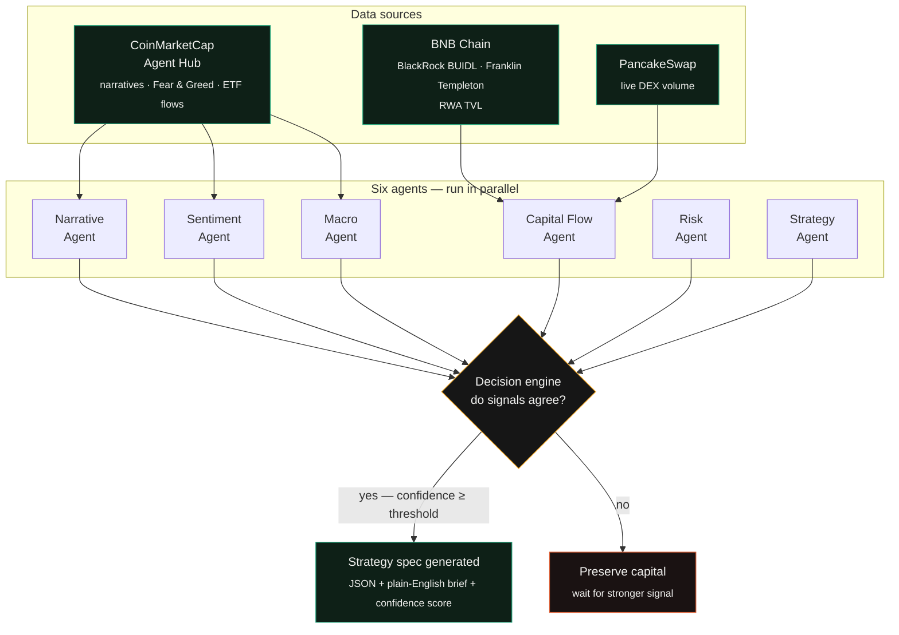

```markdown
# Aura-AI
**The AI Chief Investment Officer for every crypto investor.**

Aura-AI is a CMC Skill, built on the CoinMarketCap Agent Hub and BNB Chain, that turns live market and on-chain data into a single, backtestable trading decision. Six specialized agents read narrative, sentiment, institutional capital flow, and macro regime data in parallel, reach consensus like an investment committee, and output either a high-confidence strategy spec or a recommendation to preserve capital.

Built for **BNB Hack — Track 2: Strategy Skills.**

---

## Table of contents

- [Overview](#overview)
- [Architecture](#architecture)
- [The six agents](#the-six-agents)
- [Setup](#setup)
- [Running Aura-AI](#running-aura-ai)
- [Sample output](#sample-output)
- [Tech stack](#tech-stack)
- [Project structure](#project-structure)
- [Roadmap](#roadmap)

---

## Overview

Crypto narratives rotate fast — RWA, AI tokens, Perp DEX — and most investors can't track institutional flow, sentiment, and macro regime at once. Aura-AI does it for them in under 30 seconds.

It reads CoinMarketCap's narrative, sentiment, and macro data alongside on-chain institutional RWA flows on BNB Chain (BlackRock's BUIDL, Franklin Templeton's iBENJI), and produces a structured strategy spec — entry rules, exit rules, position sizing, and a confidence score — ready to plug into a backtester. When signals don't agree, it says so instead of forcing a trade.

---

## Architecture



> Note: this diagram renders natively on GitHub and DoraHacks. If viewing this file elsewhere, paste the code block into the [Mermaid Live Editor](https://mermaid.live) to view it.

---

## The six agents

| # | Agent | Reads | Answers |
|---|-------|-------|---------|
| 1 | **Narrative Agent** | CMC trending categories | Which sector — RWA, AI, Perp DEX — is gaining the most momentum right now? |
| 2 | **Sentiment Agent** | CMC Fear & Greed Index, social signals | Is the market fearful, neutral, or greedy? |
| 3 | **Capital Flow Agent** | BNB Chain on-chain data via BNBAgent SDK | Are institutions (BlackRock, Franklin Templeton) moving money into BNB Chain RWA right now? |
| 4 | **Macro Agent** | CMC ETF demand, cross-asset pressure | Is the broader market risk-on or risk-off? |
| 5 | **Risk Agent** | Outputs of agents 1–4 | Do enough signals agree to act safely? |
| 6 | **Strategy Agent** | All agent outputs | Which sector, which tokens, what position size? |

The decision engine counts agreement across all six. Above the confidence threshold, the Strategy Generator (LLM call) writes the final strategy spec. Below it, Aura-AI returns a "preserve capital" recommendation instead of forcing a trade.

---

## Setup

### Prerequisites

- Node.js 18+
- Python 3.10+ (if running the agent/backend layer in Python)
- A **CoinMarketCap API key**
- A **Gemini API key**

> **You must provide your own CMC API key and Gemini API key for Aura-AI to run.** Neither is bundled with this repo. See below for where to get each one and how to configure them.

### 1. Clone the repo

```bash
git clone https://github.com/<your-username>/aura-ai.git
cd aura-ai
```

### 2. Install dependencies

```bash
npm install
# or, for the Python agent layer
pip install -r requirements.txt
```

### 3. Get your API keys

**CoinMarketCap API key**
1. Go to [coinmarketcap.com/api](https://coinmarketcap.com/api/)
2. Create a free developer account
3. Copy your API key from the dashboard
4. For Agent Hub / Skill access, also register at [coinmarketcap.com/api/agent](https://coinmarketcap.com/api/agent)

**Gemini API key**
1. Go to [Google AI Studio](https://aistudio.google.com/app/apikey)
2. Sign in and click **Create API key**
3. Copy the generated key

### 4. Configure environment variables

Create a `.env` file in the project root:

```bash
cp .env.example .env
```

Then fill it in:

```env
CMC_API_KEY=your_coinmarketcap_api_key_here
GEMINI_API_KEY=your_gemini_api_key_here
```

> ⚠️ **Never commit your `.env` file.** It is already listed in `.gitignore`. Treat both keys as secrets — do not paste them into screenshots, demo videos, or public channels.

---

## Running Aura-AI

```bash
npm run dev
```

This starts the local dev server. Aura-AI will fetch live data using your CMC API key, run the six agents, and call Gemini to generate the final strategy brief.

To run the agent pipeline directly from the command line instead of the UI:

```bash
python skill/run_aura.py
```

---

## Sample output

```json
{
  "active_narrative": "RWA",
  "regime": "risk-on",
  "recommendation": "rotate 20% into ONDO",
  "entry_condition": "RWA TVL rising and Fear & Greed above 35",
  "exit_condition": "RWA TVL drops 10% or Fear & Greed below 25",
  "position_size": "20% of portfolio",
  "confidence_score": 78,
  "reasoning": "Institutional RWA inflows on BNB Chain rose $80M this week, a leading indicator that has historically preceded broader retail rotation by 5–10 days."
}
```

---

## Tech stack

- **Data layer:** CoinMarketCap Agent Hub API, BNBAgent SDK, PancakeSwap public endpoints
- **Reasoning layer:** Gemini API (agent logic + strategy spec generation)
- **Frontend:** Vite + anime.js v4
- **Backend / agents:** Python

---

## Project structure

```
aura-ai/
├── README.md
├── skill.json
├── .env.example
├── data/            # CMC, BNB Chain, PancakeSwap connectors
├── agents/          # the six agents
├── engine/          # decision engine + confidence scoring
├── generator/       # strategy spec + brief generation (Gemini)
├── skill/           # run_aura.py — main entry point
├── frontend/         # Vite + anime.js landing page
└── samples/         # example outputs
```

---

## Roadmap

- [ ] Persona-aware output (retail / fund manager / VC / exchange)
- [ ] White-label embed for exchanges and wallets
- [ ] Backtest report auto-generation against 90-day historical data
- [ ] Institutional API tier

---

**Built for BNB Hack — Track 2: Strategy Skills, powered by CMC.**
Uses the CoinMarketCap Agent Hub and the BNBAgent SDK.
```
