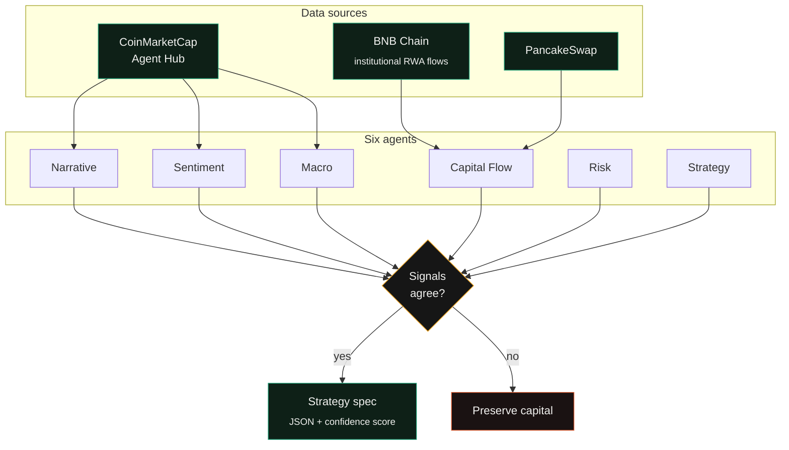

# Aura-AI

**The AI Chief Investment Officer for every crypto investor.**

A CMC Skill built on the CoinMarketCap Agent Hub and BNB Chain that turns live market and on-chain data into a single, backtestable trading decision. Six agents read narrative, sentiment, institutional flow, and macro data in parallel, reach consensus, and output either a strategy spec or a "preserve capital" call.

Built for **BNB Hack — Track 2: Strategy Skills.**

---

## How it works



---

## Setup

```bash
git clone https://github.com/<your-username>/aura-ai.git
cd aura-ai
npm install
cp .env.example .env
```

> **Requires a CoinMarketCap API key and a Gemini API key to run.** Get a CMC key at [coinmarketcap.com/api](https://coinmarketcap.com/api/), and a Gemini key at [aistudio.google.com/app/apikey](https://aistudio.google.com/app/apikey). Paste both into `.env`. Never commit this file.

```env
CMC_API_KEY=your_key_here
GEMINI_API_KEY=your_key_here
```

```bash
npm run dev
```

---

## Sample output

```json
{
  "active_narrative": "RWA",
  "recommendation": "rotate 20% into ONDO",
  "confidence_score": 78,
  "reasoning": "Institutional RWA inflows on BNB Chain rose $80M this week."
}
```

---

