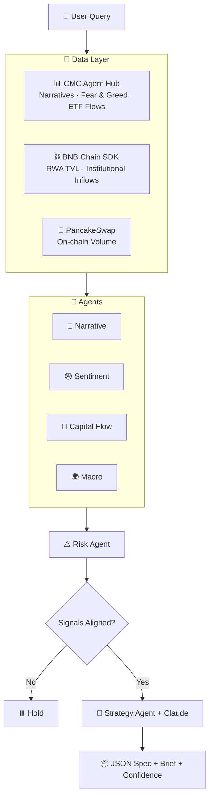

<div align="center">

# 🌌 AURA AI
### AI Capital-Rotation Engine for BNB Chain

[](#)
[](#)
[](#)
[](#)

**Reads CMC + BNB Chain data → detects capital rotation → outputs a backtestable strategy spec.**

</div>

---

## 💡 What It Does

AURA is a **CMC Skill** that watches institutional RWA inflows (BlackRock BUIDL, Franklin Templeton iBENJI) into BNB Chain as a **leading indicator**, combines it with narrative momentum + macro regime, and outputs a clean rotation strategy — JSON spec, plain-English brief, and a confidence score.

```json
{
  "active_narrative": "RWA",
  "regime": "risk-on",
  "recommendation": "Rotate 20% into RWA-aligned BNB Chain assets",
  "entry_condition": "RWA TVL rising AND Fear & Greed > 35",
  "exit_condition": "RWA TVL drops 10% OR Fear & Greed < 25",
  "confidence_score": 78,
  "reasoning": "Institutional RWA inflows on BNB Chain rose this week — a historical leading indicator for ecosystem rotation."
}
```

---

## 🏗️ Architecture



**6 agents:** 📰 Narrative · 😨 Sentiment · 🏦 Capital Flow *(the moat)* · 🌍 Macro · ⚠️ Risk · 🎯 Strategy

---

## 🛠️ Tech Stack

`Python` `FastAPI` `Anthropic Claude API` `CoinMarketCap Agent Hub (MCP)` `BNB Chain SDK` `PancakeSwap API`

---

## 📂 Structure

```
aura-ai/
├── main.py                # FastAPI entry point
├── agents/                # narrative, sentiment, capital_flow, macro, risk, strategy
├── core/                  # decision_engine.py, strategy_generator.py
├── data/                  # cmc_fetcher.py, bnb_fetcher.py
├── skill.json             # CMC Agent Hub skill definition
└── requirements.txt
```

---

## 🚀 Run It

```bash
git clone https://github.com/<your-username>/aura-ai.git
cd aura-ai
python -m venv venv && source venv/bin/activate
pip install -r requirements.txt

cp .env.example .env        # add CMC_API_KEY + ANTHROPIC_API_KEY

uvicorn main:app --reload --port 8000
```

**Call it:**

```bash
curl -X POST http://localhost:8000/api/rotate \
  -H "Content-Type: application/json" \
  -d '{"user_type": "fund_manager"}'
```

---

## 🏆 Why It Wins

| Criteria | AURA |
|---|---|
| ⚙️ Technical | Live multi-agent pipeline, real CMC + BNB Chain data |
| 🌟 Originality | Institutional RWA flow as a leading indicator — unexplored angle |
| 🌍 Relevance | Solves "where do I rotate capital" for real users |
| 🎬 Demo | One call → spec + brief + confidence, instantly readable |

**Special prize fit:** 🔵 Best Use of Agent Hub · 🟡 Best Use of BNB AI Agent SDK

---


---

<div align="center">

**🌌 Read the market. Spot the rotation. Act before retail does.**

</div>
